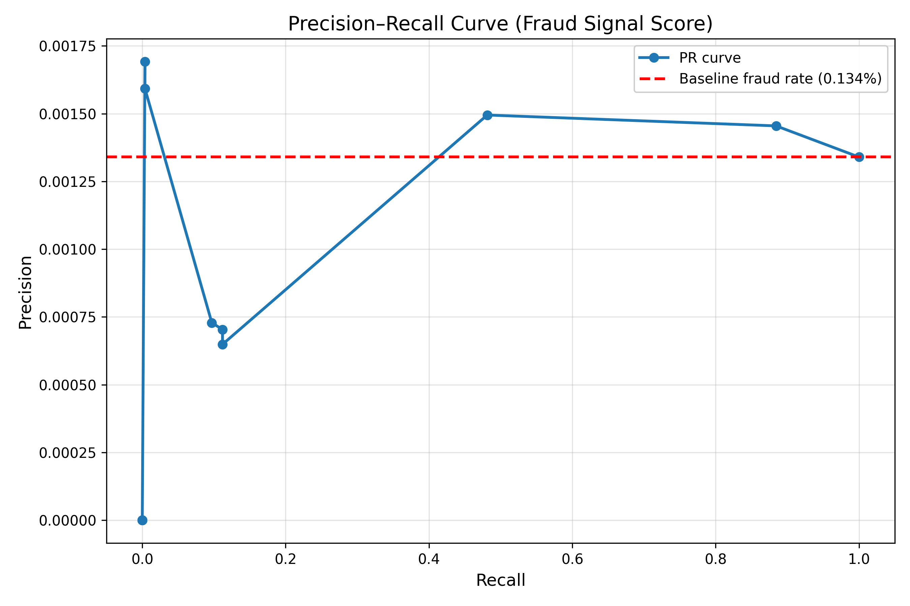

<p align="center">
  
</p>
<h1 align="center">Transaction Behavior Analytics & Fraud Signal Modeling</h1>

A dynamic fraud-detection scoring system built on 200,000 PaySim transactions, using Python (pandas, NumPy) to identify behavioral risk signals, anomaly pathways, that can help us single out mules and potential frauds. 

The project evaluates how interpretable, rule-driven scoring can support fast, cost-efficient fraud detection operations before introducing machine-learning models.

---

## Why This Project?

Fintech payment systems face fast-evolving fraud patterns where attackers show common inconsistent ledger behaviors like too many transactions in a single time window (velocity spikes), or emptying balance immediately after receiving an amount (pass-through flows) rather than simple rule violations. Detecting these anomalies early, without relying entirely on costly or opaque ML systems, is a core operational challenge.

This project examines how far behavioral analytics, engineered features, and interpretable scoring can push fraud detection on their own before introducing machine learning! 
It also raises a practical question every fraud-ops team faces: *how much actual frauds can be successfully flagged with transparent, rule-based scoring before the added cost, latency, and governance burden of ML becomes justified?*

Alongside the business framing, the project serves as an end-to-end application of Python (NumPy, pandas), feature engineering, anomaly exploration, and A/B testing of Fraud score thresholds on a large-scale transaction dataset.

---

 ## End-to-End Analysis Workflow

```
┌──────────────────────────────────────────┐
│        Raw Transactions Dataset          │
└──────────────────────────────────────────┘
                     │
                     ▼
┌──────────────────────────────────────────┐
│        Cleaning & Preparation            │
└──────────────────────────────────────────┘
                     │
                     ▼
┌──────────────────────────────────────────┐
│           Feature Engineering            │
│   - mismatch signals                     │
│   - velocity indicators                  │
│   - balance anomalies                    │
│   - mule-behavior scoring                │
└──────────────────────────────────────────┘
                     │
                     ▼
┌──────────────────────────────────────────┐
│          Exploratory Analysis            │
└──────────────────────────────────────────┘
                     │
                     ▼
┌──────────────────────────────────────────┐
│ Fraud Signal Score (Weighted Rule-Based) │
└──────────────────────────────────────────┘
                     │
                     ▼
┌──────────────────────────────────────────┐
│    A/B Testing & Threshold Evaluation    │
└──────────────────────────────────────────┘
                     │
                     ▼
┌──────────────────────────────────────────┐
│  Insights & High-Risk Account Detection  │
└──────────────────────────────────────────┘
```

---

## 🎯 Objectives

- Understand transaction behavior at scale and map strong patterns linked to fraud signals.  
- Engineer interpretable features (mismatch signals, velocity rules, mule behaviors, balance anomalies) and check how each feature can accurately flag transactions.  
- Build a **Fraud Signal Score** - a weighted, modular and easily interpretable calculated score using multiple features that are good indicators of fraud transactions, interpretable risk index.  
- Evaluate multiple scoring thresholds against real fraud cases using precision, recall, lift, and false-positive behavior to understand operational trade-offs.
- Identify high-risk accounts and transaction patterns for further investigation.

---

## 🛠 Tools & Skills Applied

- **Python (NumPy, pandas):** Data cleaning, feature engineering, and anomaly rule construction  
- **Matplotlib & Seaborn:** Behavioral visualizations, density plots, threshold curves  
- **VS Code:** End-to-end script development (ETL → features → EDA → model evaluation)
- **Data Modeling:** Transaction behavior segmentation, risk-signal construction  
- **Feature Engineering:** Velocity rules, mismatch patterns, balance signals, mule behavior indicators  
- **Fraud Analytics:** Threshold testing, precision–recall evaluation, high-risk account identification

---

## Repository Structure

```
transaction-behavior-analytics/
│
├── python/
│   ├── etl/
│   │   └── data_cleaning.py
│   │   ├── feature_engg_mismatch.py 
│   │   ├── feature_engineering_behavioral.py        
        
│   ├── analysis/
│   │   ├── _ab_testing.py
│   │   ├── plots.py
│   └── README.md
│
├── outputs/
│   ├── figures/
│   │   ├── 01_log_amount_distribution.png
│   │   ├── 02_fraud_vs_nonfraud_amount.png
│   │   ├── 03_origin_mismatch_by_type.png
│   │   ├── 04_mismatch_rate_vs_destination_activity_level.png
│   │   ├── 05_either_vs_both_mismatch.png
│   │   ├── 06_mule_score_fraud_vs_nonfraud.png
│   │   ├── 07_fraudscore_fraud_vs_nonfraud.png
│   │   └── precision_recall_curve.png
│   │
│   ├── tables/
│   │   ├── summary_log_amount.csv
│   │   ├── summary_fraud_vs_nonfraud.csv
│   │   ├── summary_origin_mismatch.csv
│   │   ├── summary_destination_mismatch.csv
│   │   ├── summary_either_both_mismatch.csv
│   │   ├── summary_mulescore_distribution.csv
│   │   ├── threshold_metrics.csv
│   │   ├── ab_test_results.csv
│   │   └── top10_high_risk_accounts.csv  
│
└── README.md
```

---

## Visual Gallery (EDA)

Exploratory analysis of transaction behavior using engineered features:

1. **Log-Amount Distribution**  
2. **Fraud vs Non-Fraud Transaction Amount**  
3. **Origin Mismatch Rate by Type**  
4. **Destination Activity vs Mismatch Rate**  
5. **Either vs Both Mismatch**  
6. **Mule Score Density (Fraud vs Non-Fraud)**  
7. **Fraud Signal Score Distribution**  

A Precision–Recall Curve is shown later under model evaluation.

_All images are stored in `outputs/figures/`._

---

## Feature Engineering Overview

Fraud is often behavioral — not statistical.  
This project focuses on engineering **interpretable, rule-based signals** across four categories:

### **1. Ledger Mismatch Signals**
- `origin_mismatch` — origin ledger mismatch (1/0)
- `dest_mismatch` — destination ledger mismatch (1/0)  
- `either_mismatch` — `origin_mismatch` OR `dest_mismatch`
- `both_mismatch` — both origin and dest mismatch (1/0)

### **2. Amount & Balance Anomalies**
- `log_amount` — `log(amount + 1)` (float)
- `is_high_amount` — thresholded high-amount flag (1/0)
- `balance_ratio` — post-tx balance / pre-tx balance (float)  
- `insufficient_funds` — flag if balance < amount (1/0) 
- `origin_drain_by_type` — cumulative drain metric for origin by transaction type. 

### **3. Velocity Features**
- `orig_tx_count_step` — count of recent outgoing tx from origin (int)
- `Dest_tx_count_step` — count of recent incoming tx to destination
- `dest_tx_count_last3` — count of recent incoming tx to destination in the last 3 consecutive steps

### **4. Mule Behavior Indicators**
- `is_pass_through` — destination immediately forwards funds (1/0)
- `is_many_senders` — destination receives from many distinct senders (1/0)  
- `is_dest_high_velocity` — destination has very high recent inbound velocity (1/0) 
- `is_high_amount` — thresholded high-amount flag (1/0)

---

## Fraud Signal Score (Interpretable Risk Index)

Weighted, rule-based scoring system combining key anomaly features into a single interpretable risk measure.:

fraud_signal_score =

2.5 * mule_score_w_high

2.5 * both_mismatch

2.0 * is_dest_velocity

1.0 * is_pass_through

1.0 * is_many_senders

1.0 * dest_burst

1.0 * is_new_dest


Why this approach?

- Fully explainable  
- No black-box ML  
- Easy to tune  
- Fast enough for real-time systems  

The output is a **single behavioral risk score** per transaction.

---

## Threshold Evaluation & A/B Testing
To operationalize the Fraud Signal Score, we test fraud signal score thresholds 3, 4, 5, 6 to see how well each cutoff separates fraud from normal traffic.
Each threshold is compared on precision, recall, false-positive rate, lift, and TP/FP/FN/TN.

Tested thresholds: **3, 4, 5, 6**

For each threshold:

- Precision  
- Recall  
- False Positive Rate  
- Lift  
- Fraud rate among flagged transactions  
- TP / FP / FN / TN counts  

A **Precision–Recall Curve** visualizes the trade-off under class imbalance.

Tables are provided in:

outputs/tables/threshold_metrics.csv
outputs/tables/ab_test_results.csv


### Top 10 high-risk accounts (based on cumulative score):
Using the final Fraud Signal Score, we identify the top 10 destination accounts with the strongest anomaly patterns (high maximum score, high total score, and dense inbound activity).

These accounts exhibit behaviors typical of money-mule aggregation or pass-through flows.
Table provided in:

outputs/tables/top10_high_risk_accounts.csv

---

## Model Performance Visuals

The following visuals summarize how the engineered behavioral features translate into risk separation, scoring quality, and threshold performance.


### Mismatch Rate vs Destination Activity

<p align="center">
  
</p>


### Mule Score Density — Fraud vs Non-Fraud

<p align="center">
  
</p>


### Fraud Signal Score Distribution — Fraud vs Non-Fraud

<p align="center">
  
</p>


### Precision–Recall Curve (Threshold Evaluation)

<p align="center">
  
</p>

## Key Insights

### 1. Behavioral signals clearly separate fraud from normal activity  
Mismatch rules, velocity spikes, and mule-like aggregation consistently push fraud transactions to higher risk scores — even without ML.

### 2. Mule patterns are the strongest fraud indicators  
Fraud accounts show rapid inbound aggregation, pass-through flows, and short-term velocity bursts.  
These behaviors are rare in normal users → high-value operational flags.

### 3. Destination-side activity exposes abnormal behavior  
Mismatch rates jump when receivers get multiple inbound payments in short windows — a classic mule consolidation pattern.

### 4. Rule-based scoring improves detection efficiently  
With only **0.13% fraud**, precision stays low (expected), but the rule-based Fraud Signal Score still ranks fraud earlier, improves recall, and gives lift over random checks.  
This makes it useful for **queue triage and ops cost reduction** before introducing ML.

### 5. A small cluster of accounts drives most risk  
Cumulative scores highlight a tiny group of accounts repeatedly triggering anomalies — ideal for targeted investigation.

---

### ⚠️ Dataset Context (to set expectations)

PaySim is synthetic and extremely imbalanced:  
- Fraud = **0.13%**  
- Many fraud patterns are semi-random  
- Merchant/receiver roles aren't fully realistic  

Even so, engineered rules still surface meaningful behavior patterns, showing how far **interpretable, low-cost** scoring can go before ML is needed.


**Insight:**  
With fraud occurring only **0.13%** of the time, baseline precision is extremely low — yet the Fraud Signal Score shows **clear ranking power**, producing a meaningful curve instead of noise.  
While absolute precision is modest (normal for synthetic imbalance), the model demonstrates **strong relative ordering**, enabling better queueing and investigation prioritization in real fraud operations.

---

## Future Work

### **1. Add a Lightweight ML Baseline**  
Compare the interpretable **Fraud Signal Score** with a simple ML model (Logistic Regression / Random Forest) to measure how much additional lift ML provides beyond rule-based scoring.

### **2. Introduce Temporal & Rolling-Window Features**  
Add time-aware indicators — time since last transaction, rolling velocity counts, and burst windows — to better capture evolving fraud behavior.

### **3. Scale to the Full 2M-Row PaySim Dataset**  
Move beyond the 200k sample and process the full dataset using efficient engines like **DuckDB** (local SQL over Parquet) or **PySpark** (distributed).  
Converting data to Parquet + performing feature engineering in DuckDB is the most practical next step before scaling further.

---

## 📚 References

- **PaySim Transaction Simulation Dataset** — Kaggle  
  https://www.kaggle.com/datasets/ealaxi/paysim1  

- **pandas Documentation** — Data manipulation and feature engineering  
  https://pandas.pydata.org/docs/

- **Matplotlib Documentation** — Plotting and visualization  
  https://matplotlib.org/stable/contents.html


## 👤 About Me

I’m **Ritvaj Madotra**, a data analyst passionate about using **Python, SQL, and business analytics** to design interpretable, impact-driven solutions.  
📌 Connect: [LinkedIn](https://www.linkedin.com/in/ritvajmadotra) | [GitHub](https://github.com/ritvaj)
